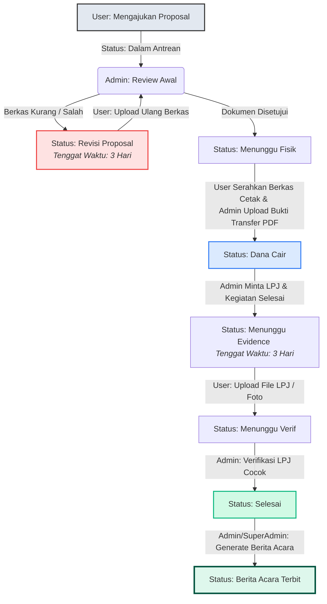

# 🗺️ Dokumentasi Teknis Sistem SIGAP (Sistem Informasi Gerak Alur Proposal)

Selamat datang di Dokumentasi Teknis Resmi **SIGAP** (Sistem Informasi Gerak Alur Proposal). Dokumen ini menyajikan panduan mendalam mengenai arsitektur sistem, struktur database, routing API, mekanisme keamanan, alur kerja aplikasi, hingga daftar *use case* yang diimplementasikan dalam sistem.

---

## 🛠️ 1. Tech Stack (Teknologi yang Digunakan)

Sistem SIGAP dibangun menggunakan arsitektur pemisahan backend dan frontend (*decoupled architecture*), di mana backend bertindak sebagai penyedia API (*Restful API*) dan frontend bertindak sebagai aplikasi halaman tunggal (*Single Page Application*) yang responsif.

| Lapisan (Layer) | Teknologi | Detail Komponen & Pustaka |
| :--- | :--- | :--- |
| **Backend Framework** | **Laravel 10** (PHP >= 8.2) | Menyediakan API endpoints, penanganan database ORM (Eloquent), otentikasi token, migrasi skema database, dan log aktivitas internal. |
| **Frontend Core** | **React JS** + **Vite** | Mengelola *state* aplikasi, interaksi pengguna secara dinamis, dan rendering komponen tanpa memuat ulang halaman. |
| **Styling (UI)** | **Vanilla CSS** | Kustomisasi penuh desain antarmuka dengan pendekatan modern (Glassmorphism, Forest Green & Pastel Accent, modern typography). |
| **PDF Engine** | **Barryvdh Laravel DomPDF** | Pustaka backend untuk me-render dokumen HTML (Blade template) menjadi berkas PDF resmi (Kop Surat, Tabel, Tanda Tangan Digital). |
| **Visualisasi Data** | **Recharts** | Pustaka visualisasi React untuk menghasilkan Donut Chart dan Bar Chart secara real-time pada Dashboard. |
| **Database** | **MySQL** / **MariaDB** | Menyimpan seluruh data user, proposal, log aktivitas, komentar/revisi, notifikasi, dan berita acara. |
| **HTTP Client** | **Axios** | Melakukan request asinkron dari React frontend ke API endpoints Laravel. |

---

## 🔒 2. Mekanisme Keamanan (Security)

Aplikasi SIGAP mengimplementasikan beberapa lapisan keamanan untuk menjamin integritas data dan membatasi akses sesuai wewenang peran (*role*):

1. **Otentikasi Berbasis Token (Laravel Sanctum)**
   Setiap request yang memerlukan autentikasi diproteksi menggunakan **Laravel Sanctum**. Token sesi dihasilkan setelah login berhasil, dan dikirimkan pada setiap header request asinkron sebagai:
   `Authorization: Bearer <personal_access_token>`.
2. **Otorisasi Berbasis Peran (Role-Based Access Control / RBAC)**
   Terdapat 3 level peran (*role*) pengguna dengan hak akses yang sangat spesifik:
   * **Super Admin (`master`)**: Akses penuh ke seluruh sistem, master database, log aktivitas sistem (*Activity Audit Log*), verifikasi berkas, pencairan dana, dan penerbitan Berita Acara.
   * **Admin Administrator (`reviewer`)**: Mengelola proposal masuk, melakukan review awal, mengunggah bukti transfer, memproses LPJ/evidence, dan men-generate Berita Acara.
   * **User (`pemohon`)**: Mengajukan proposal baru, melihat data proposal miliknya, memantau riwayat, melakukan revisi proposal jika diminta, mengunggah bukti LPJ (evidence), serta mengunduh/preview Berita Acara miliknya.
3. **Penyimpanan Berkas Terlindungi (Protected Storage Link)**
   Semua file proposal, bukti transfer, file LPJ (evidence), dan PDF Berita Acara yang diunggah disimpan di direktori internal Laravel (`storage/app/public/...`). Akses berkas dibatasi melalui endpoint khusus `/api/preview-file/{path}` guna mencegah eksploitasi URL berkas langsung.
4. **Validasi & Proteksi Input (Backend Validation & CSRF)**
   Semua data formulir divalidasi secara ketat di sisi server (misal: tipe file PDF/Doc max 10MB, angka nominal, format tanggal) sebelum disimpan ke database.

> [!NOTE]
> Sistem ini juga dilengkapi fitur simulasi login sesi cepat untuk kebutuhan presentasi, di mana pengguna dapat beralih peran dengan cepat melalui halaman login khusus (`/api/login`), yang secara otomatis akan menerbitkan token sesi Sanctum yang valid bagi akun terkait.

---

## 🗄️ 3. Skema & Struktur Database

Sistem database SIGAP terdiri dari 6 tabel utama yang saling berelasi:

### A. Tabel `users`
Menyimpan data akun pengguna sistem.
* `id` (PK, BigInt, Auto Increment)
* `name` (Varchar): Nama lengkap pengguna.
* `email` (Varchar, Unique): Email unik untuk login.
* `password` (Varchar): Hash password akun.
* `nomor_telepon` (Varchar, Nullable): Nomor kontak.
* `instansi` (Varchar, Nullable): Instansi asal (contoh: FKIP, Fak. Ekonomi).
* `whatsapp` (Varchar, Nullable): Nomor WhatsApp aktif.
* `role` (Enum): `'user'`, `'admin'`, `'superadmin'`.
* `timestamps` (`created_at`, `updated_at`)

### B. Tabel `proposals`
Menyimpan data berkas proposal yang diajukan beserta status alurnya.
* `id` (PK, BigInt, Auto Increment)
* `kode_tiket` (Varchar, Unique): Tiket otomatis dengan format `PRO-YYYYMM-XXX`.
* `user_id` (FK ke `users.id`): ID pemohon proposal.
* `kegiatan` (Varchar): Judul/nama kegiatan acara.
* `jenis` (Enum): Skema pencairan (`'Advance'`, `'Reimburse'`).
* `tgl_pelaksanaan` (Date): Rencana tanggal pelaksanaan kegiatan.
* `dana_diajukan` (Decimal 15,2): Nominal rupiah yang diajukan.
* `file_proposal` (Varchar, Nullable): Path file PDF/Doc proposal asli.
* `bukti_transfer` (Varchar, Nullable): Path slip bukti transfer PDF pencairan dana dari Admin.
* `evidence_dokumen` (Varchar, Nullable): Path file LPJ/evidence pertanggungjawaban kegiatan.
* `status` (Varchar): Status alur saat ini (default: `'Dalam Antrean'`).
* `revisi_deadline` (Timestamp, Nullable): Batas waktu 3 hari saat status revisi/evidence.
* `nama_bank`, `nomor_rekening`, `atas_nama` (Varchar, Nullable): Detail rekening bank pencairan.
* `catatan` (Text, Nullable): Catatan tambahan dari pemohon.
* `timestamps` (`created_at`, `updated_at`)

### C. Tabel `proposal_comments`
Menyimpan catatan revisi atau komentar dari Admin untuk suatu proposal.
* `id` (PK, BigInt, Auto Increment)
* `proposal_id` (FK ke `proposals.id`, On Delete Cascade)
* `user_id` (FK ke `users.id`, On Delete Cascade): ID admin/reviewer yang memberi catatan.
* `komentar` (Text): Isi catatan revisi.
* `timestamps` (`created_at`, `updated_at`)

### D. Tabel `berita_acaras`
Menyimpan data dokumen Berita Acara yang diterbitkan secara otomatis setelah proposal selesai.
* `id` (PK, BigInt, Auto Increment)
* `proposal_id` (FK ke `proposals.id`, On Delete Cascade)
* `nomor_ba` (Varchar, Unique): Nomor BA resmi berurutan (`BA-XXX/SIGAP/[Bulan Romawi]/YYYY`).
* `generated_by` (FK ke `users.id`): ID Admin/Super Admin yang menerbitkan.
* `catatan_admin` (Text, Nullable): Catatan tambahan yang dicetak dalam lembar PDF.
* `file_path` (Varchar): Path penyimpanan berkas PDF Berita Acara di server.
* `timestamps` (`created_at`, `updated_at`)

### E. Tabel `activity_logs`
Mencatat jejak audit aktivitas yang dilakukan oleh seluruh pengguna di aplikasi.
* `id` (PK, BigInt, Auto Increment)
* `user_id` (FK ke `users.id`, On Delete Set Null)
* `name` (Varchar, Nullable): Nama pengguna yang bertindak.
* `role` (Varchar, Nullable): Peran pengguna saat beraktivitas.
* `action` (Varchar): Nama tindakan (misal: "Generate Berita Acara", "Upload LPJ").
* `description` (Text, Nullable): Penjelasan detail aktivitas.
* `timestamps` (`created_at`, `updated_at`)

### F. Tabel `notifications`
Mengelola notifikasi sistem secara real-time untuk pembaruan status proposal.
* `id` (PK, BigInt, Auto Increment)
* `user_id` (FK ke `users.id`): Target penerima notifikasi.
* `title` (Varchar): Judul notifikasi.
* `message` (Text): Detail isi pesan.
* `is_read` (Boolean, default: false)
* `timestamps` (`created_at`, `updated_at`)

---

## 📡 4. Routing API (API Endpoints)

Berikut adalah daftar endpoint API backend Laravel yang diakses oleh frontend React JS:

### A. Endpoint Publik
* `POST /api/login`: Otentikasi sesi simulasi cepat (menerima payload `{ role: 'user'|'user2'|'reviewer'|'master' }`).
* `GET /api/preview-file/{path}`: Stream pratinjau dokumen proposal, evidence, atau bukti transfer secara langsung.
* `GET /api/proposals/{proposal}/berita-acara/preview`: Menampilkan pratinjau inline PDF Berita Acara tanpa download.
* `GET /api/proposals/{proposal}/berita-acara/download`: Mengunduh berkas PDF Berita Acara.

### B. Endpoint Terproteksi (`auth:sanctum`)
* `GET /api/me`: Mengembalikan data detail user yang sedang login.
* `GET /api/proposals/stats`: Mengambil statistik proposal (jumlah status, tren bulanan, total antrean).
* `GET /api/proposals`: Mengambil daftar proposal dengan dukungan pencarian (`search`), status, rentang tanggal (`date_from`/`date_to`), dan pagination.
* `POST /api/proposals`: Mengirim/mengajukan proposal baru (mendukung upload multipart file).
* `PUT /api/proposals/{id}/status`: Memperbarui status proposal dan menambahkan catatan revisi (Admin & Super Admin).
* `POST /api/proposals/{id}/upload-proposal`: Mengunggah ulang file proposal revisi baru oleh User.
* `POST /api/proposals/{id}/upload-evidence`: Mengunggah laporan pertanggungjawaban (LPJ/evidence) oleh User.
* `POST /api/proposals/{id}/upload-bukti`: Mengunggah berkas PDF Bukti Transfer pencairan dana oleh Admin.
* `POST /api/proposals/{id}/comments`: Menambahkan komentar/catatan revisi pada proposal.
* `DELETE /api/proposals/comments/{id}`: Menghapus catatan revisi tertentu (Admin & Super Admin).
* `GET /api/logs`: Mengambil data logs aktivitas sistem secara berurutan (Super Admin only).
* `GET /api/notifications`: Mengambil daftar notifikasi terbaru milik pengguna.
* `POST /api/notifications/mark-read`: Menandai seluruh notifikasi milik pengguna telah dibaca.
* `POST /api/proposals/{proposal}/berita-acara/generate`: Menerbitkan dokumen Berita Acara baru (Admin & Super Admin).
* `GET /api/berita-acara`: Mengambil daftar seluruh Berita Acara yang diterbitkan.

---

## 🔄 5. Alur Kerja Aplikasi (Workflow)

Pengajuan proposal di aplikasi SIGAP diatur melalui alur status yang ketat guna memastikan kesesuaian dokumen administrasi.

### Diagram Alur Transisi Status Proposal:



> [!IMPORTANT]
> **Sistem Deadline Otomatis:**
> Sistem secara otomatis mengaktifkan kolom `revisi_deadline` (3 hari kalender) ketika status diubah menjadi `Revisi Proposal` atau `Menunggu Evidence`. Jika User mengunggah dokumen baru sebelum tenggat waktu habis, kolom deadline akan dihapus (`null`) secara otomatis.

---

## 👥 6. Use Cases (Skenario Pengguna)

### A. Aktor: User / Pemohon (Ahmad Fauzi / Siti Rahma)
* **Pengajuan Proposal**: Menulis data kegiatan, nominal dana, tanggal, detail bank, dan melampirkan berkas PDF/Doc proposal asli.
* **Melihat Status & Riwayat**: Memeriksa daftar pengajuan di beranda portal, melihat status aktif (Dalam Antrean, Menunggu Fisik, Dana Cair, dsb).
* **Merespon Catatan Revisi**: Membaca catatan admin di kolom detail proposal, mengunggah ulang dokumen proposal baru yang telah diperbaiki.
* **Melaporkan Pertanggungjawaban**: Mengunggah berkas LPJ / foto kegiatan ketika status berubah menjadi "Menunggu Evidence".
* **Mengakses Bukti Selesai**: Melihat bukti slip transfer dana, membaca Berita Acara resmi, serta mengunduh berkas PDF Berita Acara yang diterbitkan.

### B. Aktor: Admin Administrator / Reviewer
* **Review Proposal**: Memeriksa berkas proposal secara inline, mengubah status menjadi `'Dalam Review'`, `'Revisi Proposal'` (disertai catatan), atau `'Menunggu Fisik'`.
* **Pencairan Dana**: Menerima berkas fisik proposal cetak, mengunggah slip PDF bukti pengiriman dana bank ke sistem (memperbarui status otomatis menjadi `'Dana Cair'`).
* **Verifikasi Laporan**: Memeriksa dokumen LPJ (evidence) dari user, menyetujui laporan pertanggungjawaban untuk mengubah status menjadi `'Selesai'`.
* **Menerbitkan Berita Acara**: Menulis catatan penutup admin dan menekan tombol *Generate Berita Acara* untuk proposal berstatus selesai.
* **Melihat Daftar Berita Acara**: Mengakses tabel komparasi dokumen Berita Acara yang telah diterbitkan lengkap dengan fitur cari dan unduh.

### C. Aktor: Super Admin / Master
* **Akses Seluruh Fitur Admin**: Memiliki seluruh kemampuan yang dimiliki oleh Admin Administrator.
* **Audit Jejak Aktivitas (Activity Logs)**: Memantau riwayat kronologis seluruh tindakan sistem (siapa, melakukan apa, kapan, deskripsi tindakan) untuk kepentingan transparansi audit internal.
* **Akses Master Database**: Memantau seluruh rekaman proposal dalam satu tabel komparatif tanpa filter batasan pemohon.

---

## ⚙️ 7. Panduan Pemeliharaan & Pengembangan (Development Workflow)

Untuk melakukan pemeliharaan kode atau penambahan fitur di masa mendatang, ikuti petunjuk siklus kerja berikut:

### 1. Jalankan Lingkungan Pengembangan (Development)
Untuk melakukan perubahan kode (React JS/Vite atau Laravel), jalankan kedua server secara bersamaan:
* **Backend Dev Server**: Jalankan perintah `php artisan serve` di terminal 1. Aplikasi backend akan aktif di `http://127.0.0.1:8000`.
* **Frontend Dev Server**: Jalankan perintah `npm run dev` di terminal 2. Server Vite akan aktif dan mendukung fitur *Hot Module Replacement* (HMR). Buka browser di alamat lokal yang tertera (biasanya `http://localhost:5173`).

### 2. Kompilasi Produksi (Production Build)
Apabila perubahan kode frontend telah selesai dan siap di-deploy ke server produksi atau ingin ditampilkan ke luar localhost menggunakan terowongan seperti Ngrok:
1. Hentikan server dev frontend (Ctrl + C).
2. Jalankan perintah kompilasi:
   ```bash
   npm run build
   ```
3. Hasil kompilasi berupa file HTML & JavaScript statis akan masuk ke folder `public/build` Laravel, sehingga siap dilayani langsung oleh server web produksi tanpa perlu menjalankan server Vite eksternal.

> [!TIP]
> Pastikan untuk selalu menjalankan `php artisan storage:link` di server baru agar file-file dokumen yang diunggah ke folder `storage/app/public` dapat diakses dengan lancar oleh publik.
