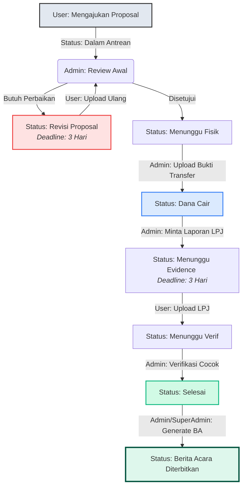

# 🗺️ Alur Kerja, Keunggulan, & Panduan Penggunaan — SIGAP

**SIGAP** (Sistem Informasi Gerak Alur Proposal) adalah platform monitoring dashboard modern yang dirancang untuk mengelola, melacak, dan memverifikasi alur pengajuan proposal secara sistematis, transparan, dan real-time. Platform ini dibangun menggunakan kombinasi backend **Laravel 10**, frontend **React JS + Vite**, dan **Vanilla CSS** untuk menyajikan antarmuka premium dengan performa tinggi.

Dokumen ini menjelaskan alur kerja sistem secara mendalam, keunggulan fitur yang ditawarkan, serta panduan praktis (walkthrough) penggunaan untuk setiap peran (*role*).

---

## 🔄 1. Alur Kerja Aplikasi (Proposal Workflow)

Proses pengajuan proposal di dalam SIGAP dirancang dengan alur yang ketat dan transparan. Berikut adalah diagram alur transisi status dari awal hingga proposal selesai dan Berita Acara diterbitkan:

### Penjelasan Detail Status & Transisi:

1. **Dalam Antrean**
   - **Deskripsi**: Proposal berhasil disimpan oleh User. Sistem secara otomatis men-generate kode tiket unik dengan format `PRO-YYYYMM-XXX` (contoh: `PRO-202606-001`).
   - **Tindakan**: File proposal (PDF/Doc) tersimpan di storage publik. Seluruh Admin dan Super Admin mendapatkan notifikasi real-time tentang pengajuan baru.
2. **Dalam Review**
   - **Deskripsi**: Admin membuka detail proposal untuk memverifikasi dokumen pengajuan, nominal dana, tanggal pelaksanaan, serta detail rekening bank.
3. **Revisi Proposal**
   - **Deskripsi**: Jika berkas salah atau tidak lengkap, Admin mengubah status ke *Revisi Proposal* dan menulis catatan revisi.
   - **Aturan Sistem**: File proposal lama otomatis dihapus dari server untuk menghemat ruang penyimpanan. Batas waktu (*deadline*) perbaikan diset otomatis selama **3 hari**. User harus mengunggah ulang dokumen revisi, yang akan mengembalikan status proposal kembali menjadi **Dalam Antrean**.
4. **Menunggu Fisik / Disetujui**
   - **Deskripsi**: Dokumen digital dinyatakan lolos verifikasi. Status diubah ke *Menunggu Fisik* sebagai instruksi bagi User untuk menyerahkan berkas fisik proposal ke kantor administrasi.
5. **Dana Cair**
   - **Deskripsi**: Admin mengunggah dokumen Bukti Transfer resmi dalam format PDF.
   - **Aturan Sistem**: Status otomatis berubah menjadi *Dana Cair* dan User menerima notifikasi bahwa dana telah ditransfer ke rekening terdaftar.
6. **Menunggu Evidence**
   - **Deskripsi**: Setelah kegiatan dilaksanakan, Admin mengaktifkan status ini agar User melampirkan Laporan Pertanggungjawaban (LPJ) beserta bukti pendukung kegiatan.
   - **Aturan Sistem**: Batas waktu unggah evidence diset otomatis selama **3 hari**.
7. **Menunggu Verif**
   - **Deskripsi**: User mengunggah file LPJ/Evidence ke sistem. Deadline otomatis di-clear (dihapus), dan status berubah menjadi *Menunggu Verif*. Admin menerima notifikasi untuk memeriksa laporan tersebut.
8. **Selesai**
   - **Deskripsi**: Admin memeriksa evidence dan menyetujui laporan pertanggungjawaban. Proposal dinyatakan selesai sepenuhnya.
9. **Penerbitan Berita Acara (BA)**
   - **Deskripsi**: Setelah status proposal `Selesai`, Admin/Super Admin dapat menekan tombol **Generate Berita Acara**.
   - **Aturan Sistem**: Nomor Berita Acara di-generate secara berurutan dan unik menggunakan format `BA-[Seq]/SIGAP/[Bulan Romawi]/[Tahun]` (contoh: `BA-001/SIGAP/VI/2026`). Sistem menggunakan DomPDF untuk merender berkas PDF resmi lengkap dengan Kop Surat, data proposal, tanda tangan digital (reviewer & pemohon), serta catatan admin. PDF disimpan secara permanen di server, dan semua role (User & Admin) dapat melakukan *Preview* maupun *Download*.

---

## 🌟 2. Keunggulan Sistem SIGAP

Sistem ini dirancang tidak hanya sebagai alat pencatat statis, melainkan platform interaktif dengan keunggulan sebagai berikut:

* **📊 Visualisasi Data Interaktif (Recharts)**
  Dashboard utama dilengkapi dengan visualisasi grafik Donut Chart (porsi status proposal) dan Bar Chart (tren pengajuan bulanan) dengan efek gradasi modern dan *rounded corners* premium.
* **🔔 Notifikasi Real-Time**
  Dilengkapi dengan panel lonceng notifikasi dinamis. Setiap transisi status (misalnya revisi diminta, dana cair, atau evidence diunggah) akan langsung memicu notifikasi tertarget ke User maupun Admin yang bersangkutan.
* **⏱️ Sistem Deadline Otomatis & Log Aktivitas**
  Sistem secara ketat mengawasi batas waktu 3 hari pada status revisi dan pengunggahan evidence guna mempercepat proses administrasi. Selain itu, setiap aksi yang dilakukan oleh semua aktor dicatat secara kronologis di halaman **Activity Log** untuk transparansi audit.
* **📄 Otomatisasi Dokumen Berita Acara (DomPDF)**
  Tidak perlu membuat berita acara manual di luar aplikasi. Hanya dengan satu klik, sistem menghasilkan PDF resmi berkualitas tinggi yang siap dicetak/diarsipkan.
* **📂 Manajemen Berkas Aman & Terpusat**
  Semua file (proposal, bukti transfer, evidence, PDF Berita Acara) dikelola menggunakan Laravel Storage. Admin dapat langsung melihat pratinjau (*preview inline*) dokumen langsung di dalam browser tanpa harus mengunduhnya terlebih dahulu.
* **📱 Desain Glassmorphism Responsif**
  Menggunakan pendekatan UI modern dengan efek transparansi, palet warna pastel minimalis (hijau hutan, biru langit lembut, merah pastel), transisi hover mikro, dan sepenuhnya responsif pada perangkat mobile.

---

## 📖 3. Panduan Penggunaan & Walkthrough

Berikut panduan langkah demi langkah cara mengoperasikan sistem SIGAP berdasarkan peran masing-masing:

### A. Sebagai User / Pemohon (Simulasi Sesi: Ahmad / Siti)

1. **Melakukan Login**
   - Buka halaman utama aplikasi di browser.
   - Klik tombol **User 1 / Pemohon (Ahmad)** atau **User 2 / Pemohon (Siti)** untuk mensimulasikan login. Anda akan diarahkan ke halaman **Portal Pemohon**.

2. **Mengajukan Proposal Baru**
   - Pada halaman Portal, klik tombol **+ Ajukan Baru** di pojok kanan atas.
   - Isi formulir pengajuan dengan lengkap:
     - *Nama Kegiatan*: Judul acara/kegiatan yang diajukan.
     - *Jenis Pengajuan*: Pilih `Advance Payment (Dana Di Depan)` atau `Reimbursement (Diganti Kemudian)`.
     - *Tanggal Pelaksanaan*: Tanggal dimulainya kegiatan.
     - *Dana Diajukan*: Nominal dalam rupiah (angka saja).
     - *File Proposal*: Upload berkas proposal asli (format PDF/Doc/Docx, maksimal 10MB).
     - *Detail Bank*: Masukkan Nama Bank, Nomor Rekening, dan Atas Nama pemilik rekening.
     - *Catatan Tambahan*: Informasi pendukung jika ada.
   - Klik **Kirim Proposal**. Status proposal Anda akan berstatus **Dalam Antrean**.

3. **Memantau Progress & Mengelola Revisi**
   - Di tab **Dashboard Portal**, Anda dapat melihat daftar proposal yang pernah diajukan.
   - Klik tombol **Track Progress / Detail** pada proposal yang diinginkan.
   - Anda akan melihat **Interactive Timeline** yang menunjukkan posisi proposal Anda saat ini.
   - **Jika Status "Revisi Proposal"**:
     - Baca **Catatan Revisi** dari Admin di kolom komentar bagian bawah modal detail.
     - Perbaiki dokumen Anda, lalu klik tombol **Upload Ulang Proposal** di dalam modal detail.
     - Unggah file revisi yang baru. Status akan otomatis kembali ke **Dalam Antrean** dan deadline perbaikan akan di-reset.

4. **Mengunggah LPJ (Evidence)**
   - Jika proposal telah disetujui, dana dicairkan (status **Dana Cair**), dan kegiatan selesai dilaksanakan, Admin akan mengubah status menjadi **Menunggu Evidence**.
   - Buka modal detail proposal Anda, klik tombol **Upload Evidence**.
   - Unggah dokumen laporan pertanggungjawaban (bisa berupa foto kegiatan, kuitansi, atau dokumen LPJ resmi dalam format PDF/JPG/PNG).
   - Klik **Simpan**. Status Anda akan berubah menjadi **Menunggu Verif**.

5. **Melihat Berita Acara**
   - Ketika status proposal sudah **Selesai** dan Admin telah menerbitkan Berita Acara, Anda akan menerima notifikasi lonceng.
   - Buka detail proposal Anda. Di bagian bawah modal, kini tersedia tombol **Preview BA** dan **Download BA**.
   - Klik **Preview BA** untuk melihat langsung PDF Berita Acara di tab baru browser, atau **Download BA** untuk menyimpannya ke perangkat Anda.

---

### B. Sebagai Admin (Reviewer / Super Admin)

1. **Melakukan Login**
   - Pada halaman login, pilih **Admin Administrator** (Reviewer) atau **Super Admin** (Master). Anda akan masuk ke **Dashboard Monitoring**.

2. **Memantau Statistik Dashboard**
   - Di halaman utama Dashboard, perhatikan grafik Donut Chart untuk melihat komposisi status proposal aktif dan Bar Chart untuk melihat total proposal yang masuk setiap bulannya.
   - Anda juga dapat menyaring grafik berdasarkan bulan tertentu menggunakan dropdown filter.

3. **Melakukan Verifikasi & Memproses Proposal**
   - Masuk ke menu **Manajemen Proposal** di sidebar.
   - Pilih proposal dengan status **Dalam Antrean** atau **Dalam Review**. Klik tombol **Detail** (ikon mata) untuk melihat informasi lengkap pengajuan.
   - Klik **Preview Dokumen** untuk memeriksa berkas proposal secara langsung.
   - Klik tombol **Ubah Status / Tindakan**:
     - Pilih **Dalam Review** jika proposal sedang diperiksa.
     - Pilih **Revisi Proposal** jika berkas kurang lengkap. Ketik alasan revisi di kolom catatan yang disediakan.
     - Pilih **Menunggu Fisik** jika proposal disetujui dan membutuhkan berkas cetak.
   - Masuk ke menu **Verifikasi Evidence** untuk melihat proposal dengan status **Menunggu Verif** (LPJ yang baru saja diunggah user). Periksa dokumen evidence, jika sudah benar ubah status menjadi **Selesai**.

4. **Mengunggah Bukti Transfer (Pencairan Dana)**
   - Ketika proposal berada pada status **Menunggu Fisik** (setelah berkas fisik diterima), klik tombol **Upload Bukti Transfer** pada modal detail.
   - Unggah file bukti transfer bank (harus berformat PDF).
   - Setelah disimpan, status proposal otomatis bertransisi menjadi **Dana Cair**.

5. **Menerbitkan (Generate) Berita Acara**
   - Cari proposal yang sudah berstatus **Selesai** (melalui menu Manajemen Proposal atau Master Database).
   - Buka modal detail proposal tersebut. Di bagian bawah, tombol **Generate Berita Acara** akan aktif.
   - Klik tombol tersebut, masukkan **Catatan Tambahan Admin** (jika ada) untuk dicantumkan dalam lembar PDF berita acara.
   - Klik **Generate**. Sistem akan merender PDF, menyimpan berkas di server, menerbitkan nomor BA unik, dan mengirim notifikasi ke user pemohon.
   - Anda kini dapat mengklik **Preview BA** atau **Download BA** pada baris proposal tersebut.

6. **Melihat Daftar Berita Acara Terbit**
   - Masuk ke menu **Daftar Berita Acara** di sidebar.
   - Halaman ini menyajikan tabel seluruh Berita Acara yang pernah diterbitkan.
   - Anda dapat mencari berdasarkan nomor BA, kode tiket, nama kegiatan, atau nama pemohon menggunakan kolom pencarian.
   - Tersedia tombol cepat **Preview** (ikon mata) dan **Download** (ikon unduh) untuk setiap baris berita acara.

7. **Audit & Ekspor Data**
   - **Activity Log (Khusus Super Admin)**: Buka menu Activity Log di sidebar untuk memantau jejak audit digital. Anda dapat melihat siapa aktor yang melakukan tindakan, tanggal kejadian, serta deskripsi detail tindakan (misalnya: mengubah status proposal, mengunggah bukti transfer, atau men-generate Berita Acara).
   - **Ekspor CSV**: Di menu Manajemen Proposal atau Master Database, Anda dapat memfilter data berdasarkan status dan rentang tanggal pelaksanaan, lalu klik tombol **Ekspor CSV** di kanan atas untuk mengunduh laporan berformat spreadsheet Excel/CSV.
